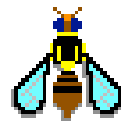
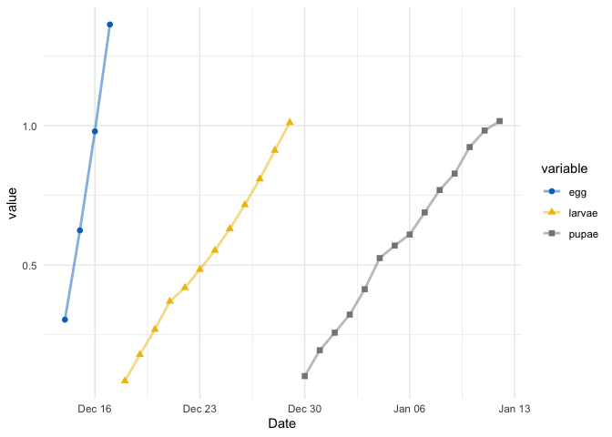
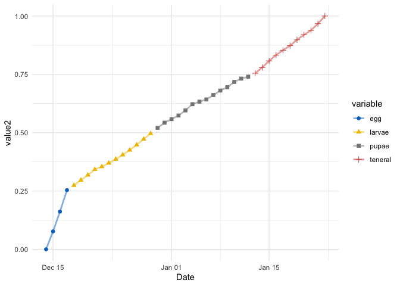

<!-- README.md is generated from README.Rmd. Please edit that file -->

# TephDev

 <!-- badges: start -->
<!-- badges: end -->

This package provides a collection of functions for models of insect
development, and for handling climate and weather data to run them on.

Note: this is very much in development and there will be plenty of bugs
(pun intended).

## Installation

You can install the development version from
[GitHub](https://github.com/) with:

``` r
# install.packages("devtools")
devtools::install_github("mattecologist/TephDev")
```

## Example

This is a basic example for running a day degree model for *Bactrocera
tryoni*, the Queensland Fruit Fly.

``` r
library(TephDev)
library (tidyverse)
#> ── Attaching packages ─────────────────────────────────────── tidyverse 1.3.0 ──
#> ✓ ggplot2 3.3.2     ✓ purrr   0.3.4
#> ✓ tibble  3.0.4     ✓ dplyr   1.0.2
#> ✓ tidyr   1.1.2     ✓ stringr 1.4.0
#> ✓ readr   1.4.0     ✓ forcats 0.5.0
#> ── Conflicts ────────────────────────────────────────── tidyverse_conflicts() ──
#> x dplyr::filter() masks stats::filter()
#> x dplyr::lag()    masks stats::lag()
library (ggplot2)
library (ggsci)
```

Using a location, create a temperature vector from Australian weather
stations (this function is used to create hourly data, so its then
straightforward to get daily Ta from there).

``` r

# Location here is for Canberra, Australia
loc <- c(-35.2809, 149.1300)
temps <- create_temp_vec(loc)
#> Registered S3 method overwritten by 'hoardr':
#>   method           from
#>   print.cache_info httr
#> Data saved as /var/folders/26/s77hy35j6qx7hmsf7ty0hg3h009y79/T//Rtmpd8MzOM/IDCJAC0010_70351_1800_Data.csv
#> Data saved as /var/folders/26/s77hy35j6qx7hmsf7ty0hg3h009y79/T//Rtmpd8MzOM/IDCJAC0011_70351_1800_Data.csv
#> Data saved as /var/folders/26/s77hy35j6qx7hmsf7ty0hg3h009y79/T//Rtmpd8MzOM/IDCJAC0010_70339_1800_Data.csv
#> Data saved as /var/folders/26/s77hy35j6qx7hmsf7ty0hg3h009y79/T//Rtmpd8MzOM/IDCJAC0011_70339_1800_Data.csv
#> Data saved as /var/folders/26/s77hy35j6qx7hmsf7ty0hg3h009y79/T//Rtmpd8MzOM/IDCJAC0010_70349_1800_Data.csv
#> Data saved as /var/folders/26/s77hy35j6qx7hmsf7ty0hg3h009y79/T//Rtmpd8MzOM/IDCJAC0011_70349_1800_Data.csv
#> Calculating sine coefficient
#> Calculating Ta

temps <- temps %>% 
  group_by(Date)%>%
  summarise(Ta=mean(Ta))%>%
  as.data.frame()
#> `summarise()` ungrouping output (override with `.groups` argument)
```

Using the model from Yonow et al. (2004) to demonstrate a simple day
degree growth for QFF.

``` r
model1 <- yonow_model(tempvec = temps$Ta, datevec = temps$Date, start.date="2019-12-14")
```

Just plotting the model output gives development times and dates for the
three stages modelled.

``` r
ggplot(model1, aes(Date, value, colour=variable))+
  geom_point(aes(shape=variable),size=2)+
  geom_line(size=1, alpha=0.5)+
  ggsci::scale_color_jco()+
  theme_minimal()
```



Its also possible to include the teneral female stage

``` r
model2 <- yonow_model(tempvec = temps$Ta, datevec = temps$Date, start.date="2019-12-14",
                      adult = TRUE)
```

An with some simple formatting, can scale the outputs….

``` r

model2$value[model2$variable == "larvae"] <- model2$value[model2$variable == "larvae"] + max(model2$value[model2$variable =="egg"])

model2$value[model2$variable == "pupae"] <- model2$value[model2$variable == "pupae"] + max(model2$value[model2$variable =="larvae"])

model2$value[model2$variable == "teneral"] <- model2$value[model2$variable == "teneral"] + max(model2$value[model2$variable =="pupae"])

model2 <- model2 %>%
  mutate(value2=scales::rescale(value, to = c(0, 1)))
```

….which gives a 0-1 development across the entire lifecycle

``` r
ggplot(model2, aes(Date, value2, colour=variable))+
  geom_point(aes(shape=variable),size=2)+
  geom_line(size=1, alpha=0.5)+
  ggsci::scale_color_jco()+
  theme_minimal()
```



## References

Yonow, T, M.P Zalucki, R.W Sutherst, B.C Dominiak, G.F Maywald, D.A
Maelzer, and D.J Kriticos. “Modelling the Population Dynamics of the
Queensland Fruit Fly, Bactrocera (Dacus) Tryoni: A Cohort-Based Approach
Incorporating the Effects of Weather.” Ecological Modelling 173, no. 1
(March 2004): 9–30. <https://doi.org/10.1016/S0304-3800(03)00306-5>.
